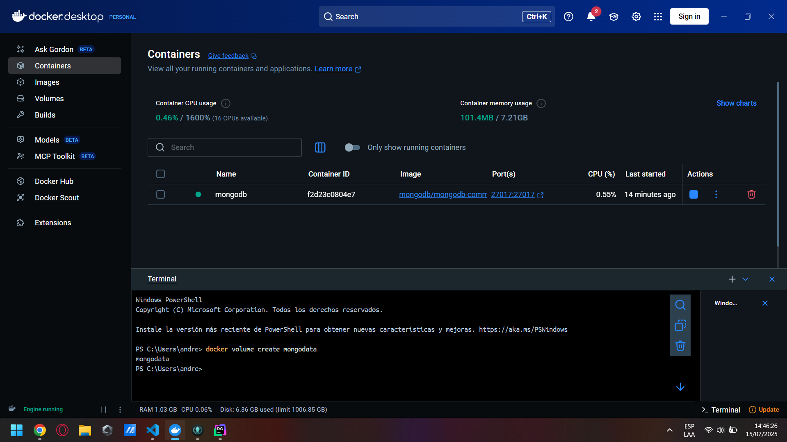
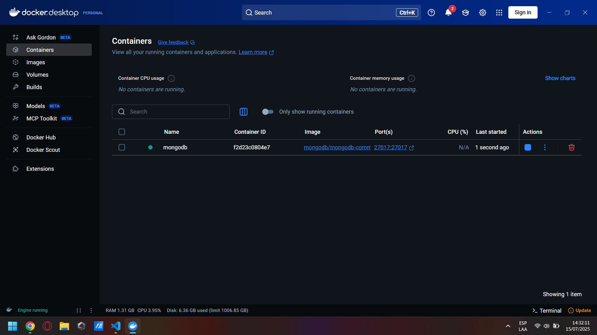
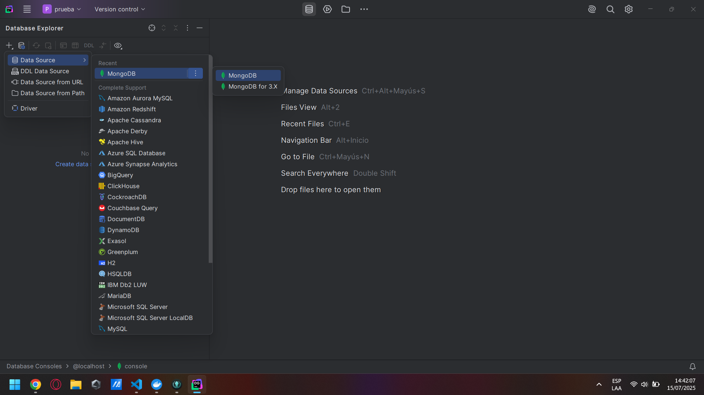
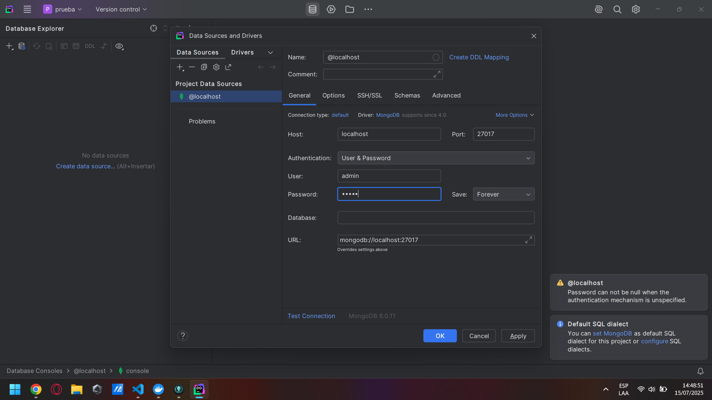
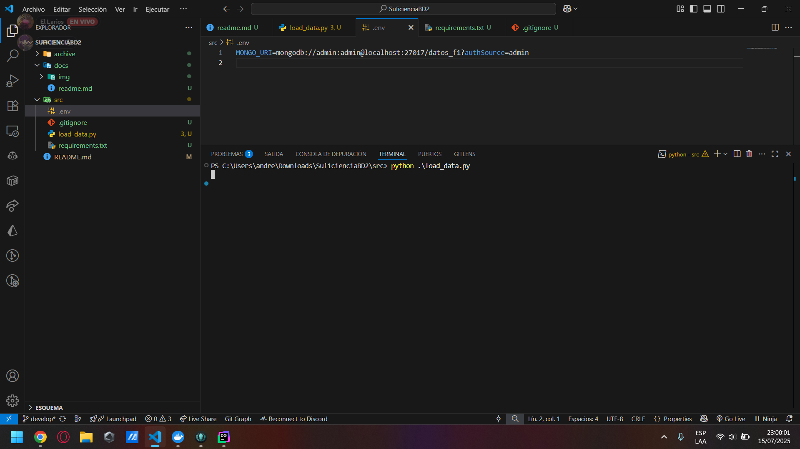
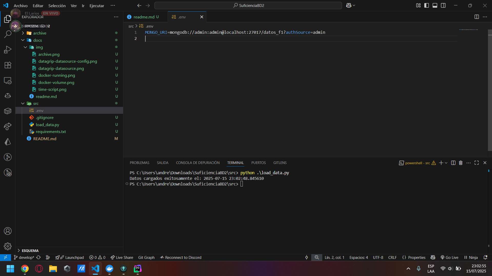
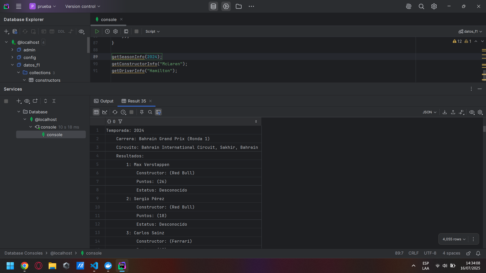
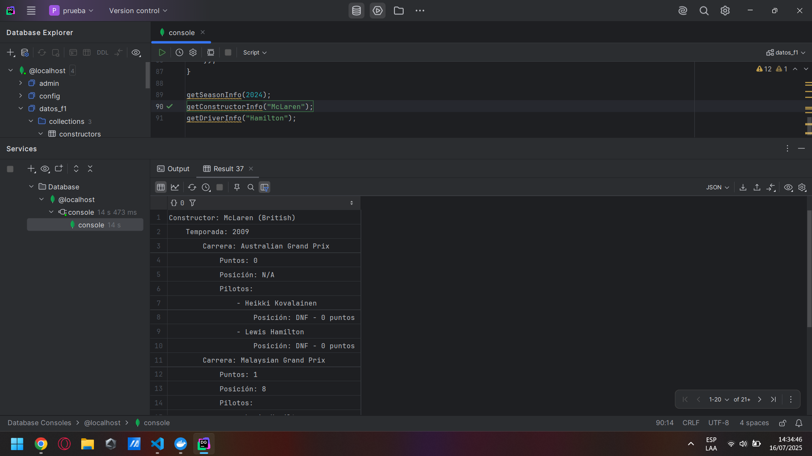
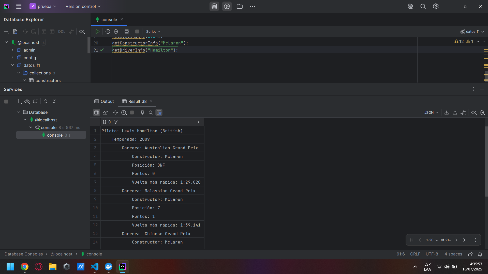

# Suficiencia - Sistemas de Bases de Datos 2

## Datos
| Nombre                       | Carnet    |
| ---------------------------- | --------- |
| Sergio Andrés Larios Fajardo | 202111849 |

## Índice
- [Suficiencia - Sistemas de Bases de Datos 2](#suficiencia---sistemas-de-bases-de-datos-2)
  - [Datos](#datos)
  - [Índice](#índice)
  - [Introducción](#introducción)
  - [Descripción de la Solución](#descripción-de-la-solución)
    - [Procedimiento](#procedimiento)
      - [Descarga de Datasets](#descarga-de-datasets)
      - [Copiar la imagen](#copiar-la-imagen)
      - [Crear volumen para Mongo](#crear-volumen-para-mongo)
      - [Crear contenedor](#crear-contenedor)
        - [Contenedor corriendo](#contenedor-corriendo)
      - [Conexión a MongoDB con DataGrip](#conexión-a-mongodb-con-datagrip)
    - [Base de Datos](#base-de-datos)
      - [Colecciones](#colecciones)
        - [Esquema Detallado](#esquema-detallado)
          - [Colección de Temporadas (*seasons*)](#colección-de-temporadas-seasons)
          - [Colección de Constructores (equipos o escudería) (*constructors*)](#colección-de-constructores-equipos-o-escudería-constructors)
          - [Colección de Pilotos (*drivers*)](#colección-de-pilotos-drivers)
      - [Diagramas](#diagramas)
          - [Colección de Temporadas (*seasons*)](#colección-de-temporadas-seasons-1)
          - [Colección de Constructores (equipos o escudería) (*constructors*)](#colección-de-constructores-equipos-o-escudería-constructors-1)
          - [Colección de Pilotos (*drivers*)](#colección-de-pilotos-drivers-1)
      - [Justificación](#justificación)
    - [Scripts de Python](#scripts-de-python)
      - [Pre-requisitos](#pre-requisitos)
      - [Script](#script)
      - [Capturas](#capturas)
      - [Métodos para consultas](#métodos-para-consultas)
        - [Temporada](#temporada)
        - [Constructor (Escudería)](#constructor-escudería)
        - [Piloto (Conductor)](#piloto-conductor)


## Introducción
El objetivo del proyecto es construir una base de datos en [MongoDB](mongodb.com) de los datos de [Formula 1 World Championship (1950 - 2024)](https://www.kaggle.com/datasets/rohanrao/formula-1-world-championship-1950-2020/data), diseñar un esquema no relacional desnormalizado, cargar los datos e implementar métodos para consultar temporadas, constructores y pilotos. El proyecto aprovecha la estructura de MongoDB basada en documentos, [Python](https://www.python.org/) para el procesamiento de datos y [DataGrip](https://www.jetbrains.com/es-es/datagrip/) para interacción con la base de datos.

## Descripción de la Solución

### Procedimiento

#### Descarga de Datasets
Para el proyecto se utilizaron los datasets de [Formula 1 World Championship (1950 - 2024)](https://www.kaggle.com/datasets/rohanrao/formula-1-world-championship-1950-2020/data) proveídos por la plataforma [Kaggle](https://www.kaggle.com/)

#### Copiar la imagen
Se descarga la imagen de más reciente de MongoDB.
```bash
docker pull mongodb/mongodb-community-server:latest
```

#### Crear volumen para Mongo
Se crea un volumen para la persistencia de datos.
```bash
docker volume create mongodata
```



#### Crear contenedor
Creación del contenedor que ejecutará MongoDB, haciendo uso del volumen creado anteriormente y la imagen descargada.
```bash
docker run --name mongodb -p 27017:27017 -v mongodata:/data/db -e MONGODB_INITDB_ROOT_USERNAME=admin -e MONGODB_INITDB_ROOT_PASSWORD=admin mongodb/mongodb-community-server:latest
```

##### Contenedor corriendo


#### Conexión a MongoDB con DataGrip
DataGrip se conecta al contenedor de MongoDB para interactuar con la base de datos.




### Base de Datos

En MongoDB, las bases de datos se crean con `use`.
```javascript
use datos_f1
```

#### Colecciones
El esquema propuesto utiliza 3 colecciones principales para la base de datos, brindando un balance entre flexibilidad y rendimiento.

1. **Temporadas (_seasons_)**: Contiene información de la temporada, carreras y sus resultados.
2. **Constructores (equipos o escudería) (_constructors_)**: Guarda información de los constructores, incluyendo resultados de las carreras y pilotos.
3. **Pilotos (_drivers_)**: Guarda la información del piloto, incluyendo sus carreras y constructores.

##### Esquema Detallado
###### Colección de Temporadas (*seasons*)

```javascript
{
    year: Number,
    url: String,
    races: [
        {
            raceId: Number,
            round: Number,
            circuit: {
                circuitId: Number,
                name: String,
                location: String,
                country: String,
                lat: Number,
                lng: Number
            },
            date: String,
            time: String,
            results: [
                {
                    driverId: Number,
                    constructorId: Number,
                    position: String,
                    points: Number,
                    laps: Number,
                    fastestLapTime: String,
                    status: String
                }
            ],
            qualifying: [
                {
                    driverId: Number,
                    constructorId: Number,
                    position: Number,
                    q1: String,
                    q2: String,
                    q3: String
                }
            ],
            sprint_results: [
                {
                    driverId: Number,
                    constructorId: Number,
                    position: String,
                    points: Number
                }
            ],
            pit_stops: [
                {
                    driverId: Number,
                    lap: Number,
                    duration: String
                }
            ],
            lap_times: [
                {
                    driverId: Number,
                    lap: Number,
                    time: String
                }
            ]
        }
    ]
}
```

###### Colección de Constructores (equipos o escudería) (*constructors*)  

```javascript
{
    constructorId: Number,
    name: String,
    nationality: String,
    url: String,
    seasons: [
        {
            year: Number,
            races: [
                {
                    raceId: Number,
                    points: Number,
                    position: String,
                    drivers: [
                        {
                            driverId: Number,
                            position: String,
                            points: Number
                        }
                    ]
                }
            ]
        }
    ]
}
```

###### Colección de Pilotos (*drivers*) 

```javascript
{
    driverId: Number,
    code: String,
    forename: String,
    surname: String,
    dob: String,
    nationality: String,
    url: String,
    seasons: [
        {
            year: Number,
            races: [
                {
                    raceId: Number,
                    constructorId: Number,
                    position: String,
                    points: Number,
                    fastestLapTime: String
                }
            ]
        }
    ]
}
```

#### Diagramas

###### Colección de Temporadas (*seasons*)
```Mermaid
flowchart TD
    subgraph ROOT["Temporadas"]
        year["year : Number"]
        url["url  : String"]

        subgraph races_array["Carreras"]
            raceId["raceId : Number"]
            round["round  : Number"]
            date["date   : String"]
            time["time   : String"]

            subgraph CIRCUIT["Circuitos"]
                circuitId["circuitId : Number"]
                name["name      : String"]
                location["location : String"]
                country["country  : String"]
                lat["lat : Number"]
                lng["lng : Number"]
            end

            subgraph RESULTS["Resultados"]
                driverId_r["driverId       : Number"]
                constructorId_r["constructorId : Number"]
                position_r["position       : String"]
                points_r["points         : Number"]
                laps_r["laps           : Number"]
                fastestLapTime["fastestLapTime : String"]
                status_r["status         : String"]
            end

            subgraph QUALI["Participantes"]
                driverId_q["driverId       : Number"]
                constructorId_q["constructorId : Number"]
                position_q["position       : Number"]
                q1["q1 : String"]
                q2["q2 : String"]
                q3["q3 : String"]
            end

            subgraph SPRINT["Resultados del Sprint"]
                driverId_s["driverId       : Number"]
                constructorId_s["constructorId : Number"]
                position_s["position       : String"]
                points_s["points         : Number"]
            end

            subgraph PITS["Paradas de Pits"]
                driverId_p["driverId : Number"]
                lap_p["lap      : Number"]
                duration_p["duration : String"]
            end

            subgraph LAPS["Tiempos de Vuelta"]
                driverId_l["driverId : Number"]
                lap_l["lap      : Number"]
                time_l["time     : String"]
            end
        end
    end

```

###### Colección de Constructores (equipos o escudería) (*constructors*) 

```Mermaid
flowchart TD
    subgraph ROOT["Constructor"]
        constructorId["constructorId : Number"]
        name["name         : String"]
        nationality["nationality  : String"]
        url["url          : String"]

        subgraph SEASONS_ARRAY["Temporadas"]
            year["year : Number"]

            subgraph RACES_ARRAY["Carreras"]
                raceId["raceId  : Number"]
                points_r["points  : Number"]
                position_r["position : String"]

                subgraph DRIVERS_ARRAY["Pilotos"]
                    driverId["driverId : Number"]
                    position_d["position : String"]
                    points_d["points   : Number"]
                end
            end
        end
    end
```
###### Colección de Pilotos (*drivers*) 

```Mermaid
flowchart TD
    subgraph ROOT["Pilotos"]
        driverId["driverId       : Number"]
        code["code            : String"]
        forename["forename        : String"]
        surname["surname         : String"]
        dob["dob             : String"]
        nationality["nationality    : String"]
        url["url             : String"]

        subgraph SEASONS_ARRAY["Temporadas"]
            year["year : Number"]

            subgraph RACES_ARRAY["Carreras"]
                raceId["raceId        : Number"]
                constructorId["constructorId : Number"]
                position_r["position      : String"]
                points_r["points        : Number"]
                fastestLapTime["fastestLapTime : String"]
            end
        end
    end
```


#### Justificación
- **Desnormalización:** Insertar resultados de las carreras, tiempos de llegada y datos del circuito dentro de las temporadas reduce la necesidad para consultas entre colecciones.
- **Flexibilidad:** Separar colecciones por constructores y pilotos permiten consultas más eficientes.
- **Escalabilidad:** La estructura soporta datasets de gran tamaño mientras se mantiene rendimiento en las consultas.

### Scripts de Python
#### Pre-requisitos
Librerías pymongo para la conexión con MongoDB y pandas para la manipulación de los datos.

```bash
pip install pymongo pandas python-dotenv
```

#### Script
El [script de Python](../src/load_data.py) crea las colecciones de la base de datos en base a lo planteado anteriormente.

Instalar dependencias
```bash
pip install -r requirements.txt
```

Ejecutar el script
```bash
python load_data.py
```

#### Capturas
Inicio de ejecución del Script


Final de ejecución del Script


#### Métodos para consultas

##### Temporada
```javascript
function getSeasonInfo(year) {
    const season = db.seasons.findOne({ year: year });
    if (!season) {
    print(`No se encontraron datos para la temporada ${year}`);
    return;
    }

    print(`Temporada: ${season.year}`);
    season.races.forEach(race => {
        print(`    Carrera: ${race.name} (Ronda ${race.round})`);
        print(`    Circuito: ${race.circuit.name}, ${race.circuit.location}, ${race.circuit.country}`);
        print("    Resultados:");
        race.results.forEach(result => {
            const driver = db.drivers.findOne({ driverId: result.driverId });
            const constructor = db.constructors.findOne({ constructorId: result.constructorId });
            const status = db.status.findOne({ statusId: result.statusId });
            print(`        ${result.position || 'DNF'}: ${driver.forename} ${driver.surname}`);
            print(`            Constructor: (${constructor.name})`);
            print(`            Puntos: (${result.points})`);
            print(`            Estatus: ${status ? status.status : 'Desconocido'}`);
        });
        print("    Participantes:");
        race.qualifying.forEach(qual => {
            const driver = db.drivers.findOne({ driverId: qual.driverId });
            print(`        ${qual.position}: ${driver.forename}`);
            print(`            Q1: ${qual.q1 || 'N/A'}`);
            print(`            Q2: ${qual.q2 || 'N/A'}`);
            print(`            Q3: ${qual.q3 || 'N/A'}`);
        });
        if (race.sprint_results.length > 0) {
            print("    Resultados del Sprint:");
            race.sprint_results.forEach(sprint => {
                const driver = db.drivers.findOne({ driverId: sprint.driverId });
                print(`  ${sprint.position}: ${driver.forename} ${driver.surname} - ${sprint.points} puntos`);
            });
        }
    });
}

getSeasonInfo(2024);
```



##### Constructor (Escudería)
```javascript
function getConstructorInfo(constructorName) {
    const constructor = db.constructors.findOne({ name: constructorName });
    if (!constructor) {
        print(`No se encontraron datos para el constructores ${constructorName}`);
        return;
    }

    print(`Constructor: ${constructor.name} (${constructor.nationality})`);
    constructor.seasons.forEach(season => {
        print(`    Temporada: ${season.year}`);
        season.races.forEach(race => {
            const raceDetails = db.seasons.findOne({ "races.raceId": race.raceId }, { "races.$": 1 });
            print(`        Carrera: ${raceDetails.races[0].name}`);
            print(`            Puntos: ${race.points}`);
            print(`            Posición: ${race.position || 'N/A'}`);
            print("            Pilotos:");
            race.drivers.forEach(driver => {
                const driverDetails = db.drivers.findOne({ driverId: driver.driverId });
                print(`                - ${driverDetails.forename} ${driverDetails.surname}`);
                print(`                    Posición: ${driver.position || 'DNF'} - ${driver.points} puntos`);
            });
        });
    });
}

getConstructorInfo("McLaren");
```



##### Piloto (Conductor)
```javascript
function getDriverInfo(driverSurname) {
    const driver = db.drivers.findOne({ surname: driverSurname });
    if (!driver) {
        print(`No se encontraron datos para el piloto ${driverSurname}`);
        return;
    }

    print(`Piloto: ${driver.forename} ${driver.surname} (${driver.nationality})`);
    driver.seasons.forEach(season => {
        print(`    Temporada: ${season.year}`);
        season.races.forEach(race => {
            const raceDetails = db.seasons.findOne({ "races.raceId": race.raceId }, { "races.$": 1 });
            const constructor = db.constructors.findOne({ constructorId: race.constructorId });
            print(`        Carrera: ${raceDetails.races[0].name}`);
            print(`            Constructor: ${constructor.name}`);
            print(`            Posición: ${race.position || 'DNF'}`);
            print(`            Puntos: ${race.points}`);
            print(`            Vuelta más rápida: ${race.fastestLapTime || 'N/A'}`);
        });
    });
}

getDriverInfo("Hamilton");
```

