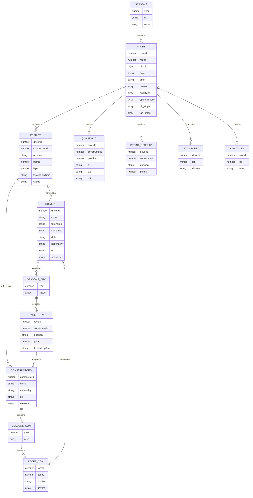

# Suficiencia - Sistemas de Bases de Datos 2

## Datos
| Nombre                       | Carnet    |
| ---------------------------- | --------- |
| Sergio Andrés Larios Fajardo | 202111849 |

## Índice
- [Suficiencia - Sistemas de Bases de Datos 2](#suficiencia---sistemas-de-bases-de-datos-2)
  - [Datos](#datos)
  - [Índice](#índice)
  - [Introducción](#introducción)
  - [Descripción de la Solución](#descripción-de-la-solución)
    - [Procedimiento](#procedimiento)
      - [Descarga de Datasets](#descarga-de-datasets)
      - [Copiar la imagen](#copiar-la-imagen)
      - [Crear volumen para Mongo](#crear-volumen-para-mongo)
      - [Crear contenedor](#crear-contenedor)
        - [Contenedor corriendo](#contenedor-corriendo)
      - [Conexión a MongoDB con DataGrip](#conexión-a-mongodb-con-datagrip)
    - [Base de Datos](#base-de-datos)
      - [Colecciones](#colecciones)
        - [Esquema Detallado](#esquema-detallado)
          - [Colección de Temporadas (*seasons*)](#colección-de-temporadas-seasons)
          - [Colección de Constructores (equipos o escudería) (*constructors*)](#colección-de-constructores-equipos-o-escudería-constructors)
        - [Colección de Pilotos (*drivers*)](#colección-de-pilotos-drivers)
      - [Justificación](#justificación)
      - [Visualización](#visualización)
    - [Scripts de Python](#scripts-de-python)
      - [Pre-requisitos](#pre-requisitos)
      - [Script](#script)
      - [Capturas](#capturas)


## Introducción
El objetivo del proyecto es construir una base de datos en [MongoDB](mongodb.com) de los datos de [Formula 1 World Championship (1950 - 2024)](https://www.kaggle.com/datasets/rohanrao/formula-1-world-championship-1950-2020/data), diseñar un esquema no relacional desnormalizado, cargar los datos e implementar métodos para consultar temporadas, constructores y pilotos. El proyecto aprovecha la estructura de MongoDB basada en documentos, [Python](https://www.python.org/) para el procesamiento de datos y [DataGrip](https://www.jetbrains.com/es-es/datagrip/) para interacción con la base de datos.

## Descripción de la Solución

### Procedimiento

#### Descarga de Datasets
Para el proyecto se utilizaron los datasets de [Formula 1 World Championship (1950 - 2024)](https://www.kaggle.com/datasets/rohanrao/formula-1-world-championship-1950-2020/data) proveídos por la plataforma [Kaggle](https://www.kaggle.com/)

#### Copiar la imagen
Se descarga la imagen de más reciente de MongoDB.
```bash
docker pull mongodb/mongodb-community-server:latest
```

#### Crear volumen para Mongo
Se crea un volumen para la persistencia de datos.
```bash
docker volume create mongodata
```


#### Crear contenedor
Creación del contenedor que ejecutará MongoDB, haciendo uso del volumen creado anteriormente y la imagen descargada.
```bash
docker run --name mongodb -p 27017:27017 -v mongodata:/data/db -e MONGODB_INITDB_ROOT_USERNAME=admin -e MONGODB_INITDB_ROOT_PASSWORD=admin mongodb/mongodb-community-server:latest
```

##### Contenedor corriendo


#### Conexión a MongoDB con DataGrip
DataGrip se conecta al contenedor de MongoDB para interactuar con la base de datos.


### Base de Datos

En MongoDB, las bases de datos se crean con `use`.
```javascript
use datos_f1
```

#### Colecciones
El esquema propuesto utiliza 3 colecciones principales para la base de datos, brindando un balance entre flexibilidad y rendimiento.

1. **Temporadas (_seasons_)**: Contiene información de la temporada, carreras y sus resultados.
2. **Constructores (equipos o escudería) (_constructors_)**: Guarda información de los constructores, incluyendo resultados de las carreras y pilotos.
3. **Pilotos (_drivers_)**: Guarda la información del piloto, incluyendo sus carreras y constructores.

##### Esquema Detallado
###### Colección de Temporadas (*seasons*)

```javascript
{
    year: Number,
    url: String,
    races: [
        {
        raceId: Number,
        round: Number,
        circuit: {
            circuitId: Number,
            name: String,
            location: String,
            country: String,
            lat: Number,
            lng: Number
        },
        date: String,
        time: String,
        results: [
            {
                driverId: Number,
                constructorId: Number,
                position: String,
                points: Number,
                laps: Number,
                fastestLapTime: String,
                status: String
            }
        ],
        qualifying: [
            {
                driverId: Number,
                constructorId: Number,
                position: Number,
                q1: String,
                q2: String,
                q3: String
            }
        ],
        sprint_results: [
            {
                driverId: Number,
                constructorId: Number,
                position: String,
                points: Number
            }
        ],
        pit_stops: [
            {
                driverId: Number,
                lap: Number,
                duration: String
            }
        ],
        lap_times: [
            {
                driverId: Number,
                lap: Number,
                time: String
            }
        ]
        }
    ]
}
```

###### Colección de Constructores (equipos o escudería) (*constructors*)  

```javascript
{
    constructorId: Number,
    name: String,
    nationality: String,
    url: String,
    seasons: [
        {
        year: Number,
        races: [
            {
                raceId: Number,
                points: Number,
                position: String,
                drivers: [
                    {
                        driverId: Number,
                        position: String,
                        points: Number
                    }
                ]
            }
        ]
        }
    ]
}
```

##### Colección de Pilotos (*drivers*) 

```javascript
{
    driverId: Number,
    code: String,
    forename: String,
    surname: String,
    dob: String,
    nationality: String,
    url: String,
    seasons: [
        {
        year: Number,
        races: [
            {
                raceId: Number,
                constructorId: Number,
                position: String,
                points: Number,
                fastestLapTime: String
            }
        ]
        }
    ]
}
```

#### Justificación
- **Desnormalización:** Insertar resultados de las carreras, tiempos de llegada y datos del circuito dentro de las temporadas reduce la necesidad para consultas entre colecciones.
- **Flexibilidad:** Separar colecciones por constructores y pilotos permiten consultas más eficientes.
- **Escalabilidad:** La estructura soporta datasets de gran tamaño mientras se mantiene rendimiento en las consultas.

#### Visualización


### Scripts de Python
#### Pre-requisitos
Librerías pymongo para la conexión con MongoDB y pandas para la manipulación de los datos.

```bash
pip install pymongo pandas python-dotenv
```

#### Script
El [script de Python](../src/load_data.py) crea las colecciones de la base de datos en base a lo planteado anteriormente.

Instalar dependencias
```bash
pip install -r requirements.txt
```

Ejecutar el script
```bash
python load_data.py
```

#### Capturas
Inicio de ejecución del Script


Final de ejecución del Script
